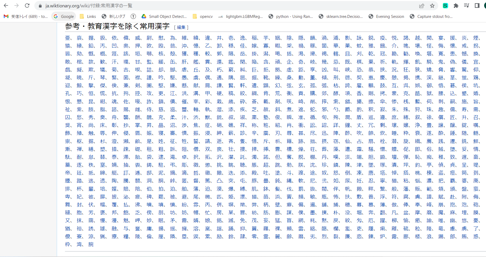
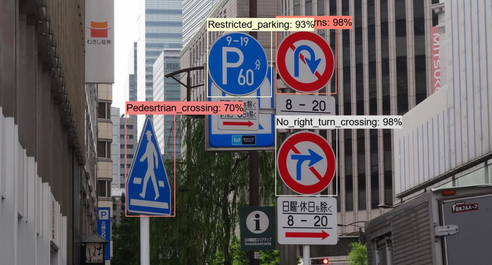

# CloudVisionTextBoxRecognizer
Google Cloud Vision Text Recognizer

This a simple command line client to Google Cloud Vision Text Recognizer. 

<h2> 
1 Install
</h2>
Please install Coogle Cloud SDK on your PC. We use Windows11 OS. 
Install the Google Cloud CLI 
https://cloud.google.com/sdk/docs/install-sdk
 

 
<h2>
2 Install python packages
</h2>
Please clone this repository to your local PC. 
We use Python3 venv on Windows11 OS.
 
>pip install requirements.txt
</h2>

<h2>
3 Sample Program
</h2>
Please open <b>Cloud Tools for PowerShell</b> from <b>Google Cloud SDK</b>. 

 

Please run the following command in <b>Cloud Tools for PowerShell</b> console. 

> python CloudVisionTextBoxRecognizer.py 
 
This CloudVisionTextBoxRecognizer.py script reads the recognition.conf file. 
<pre>
[parameter]
images_dir   = "./samples"
;output_dir   = "./outputs"
output_dir   = "./non_preprocessed"
image_format = ".png"
language_hints   = ["ja"]

[preprocessor]
;preprocessing    = True
preprocessing    = False
gray_image       = True
image_scaling    = 3
contrast         = 1.5
sharpness        = 3

[visualizer]
font_name        = "BIZ-UDMinchoM.ttc"
draw_boundingbox = True
expanding_ratio  = 1.0
scaling_on_nonpreprocessing = 3
</pre>

Please note that we specify the language_hints in this config file to be ["ja"] to recognize Japanese text. 
You have to change this language_hints property depending on your text language. 

Example 1: 参考・教育漢字を除く常用漢字.png 
 
 

Text Box Recognition: 

 

Example 2: 付録常用漢字の一覧_付表 
 
 

Text Box Recognition: 

 

Example 3: 半角カタカナ一覧 
 
 

Text Box Recognition: 

 

Example 4: VSCodeScreenShot 
 
 

Text Box Recognition: 

 

Example 5: Symbols_Kakana 
 
 

Text Box Recognition: 

 

Example 6: RoadSign.png 
 
 

Text Box Recognition: 

 

Example 7: ARTIZON_MUSEUM.png 
 
 

Text Box Recognition: 

 

Example 8: Nihonbashi-Takashimaya.png 
 
 

Text Box Recognition: 

 

Example 9: Chuoh-Street.png 
 
 

Text Box Recognition: 

 

Example 10: No_parking.png 
 
 

Text Box Recognition: 

 

Example 11: NadaDana.png 
 
 

Text Box Recognition: 

 

